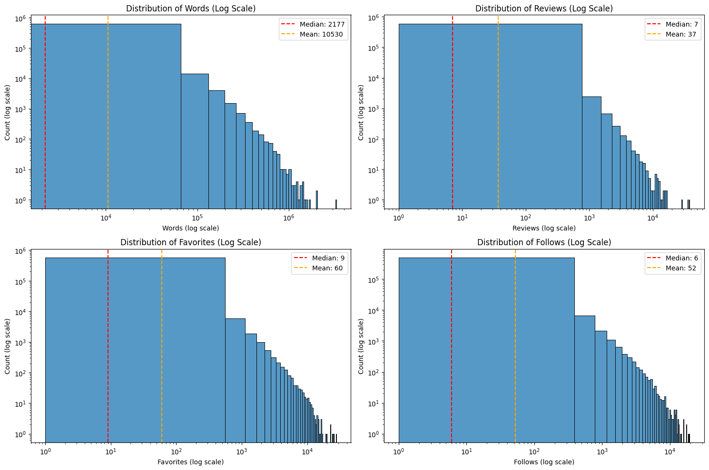
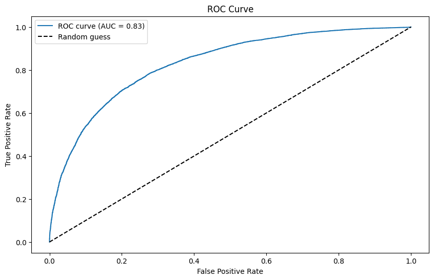

# 🪄 Harry Potter Fan Fiction Logistic Regression Analysis

<div align="center">


**Mastering Logistic Regression with Interaction and Polynomial Terms on Harry Potter Fan Fiction Data**

[🎯 Overview](#-project-overview) • [📊 Results](#-results) • [🚀 Quick-Start](#-quick-start) • [📦 Learning Journey](#-learning-journey)

</div>

> Advanced logistic regression analysis: Successfully implemented interaction terms, polynomial features, and data leakage detection. Next up: model comparison, statistical analysis, and scikit-learn evaluation.

---

## 👨‍💻 Author
<div align="center">

**Francisco Teixeira Barbosa**

[](https://github.com/Tuminha)
[](https://www.kaggle.com/franciscotbarbosa)
[](mailto:cisco@periospot.com)
[](https://twitter.com/cisco_research)

*Learning Machine Learning through CodeCademy • Building AI solutions step by step*

</div>

---

## 🎯 Project Overview
- **What:** Advanced logistic regression analysis of Harry Potter fan fiction popularity using interaction and polynomial terms
- **Why:** Master complex feature engineering techniques and understand how variables interact in real-world data
- **Expected Outcome:** Comprehensive understanding of logistic regression with advanced terms, model interpretation skills, and insights into fan fiction popularity factors

### 🎓 Learning Objectives
- Master interaction terms (Binary×Quantitative, Quantitative×Quantitative, Binary×Binary)
- Understand polynomial (quadratic) terms for non-linear relationships
- Compare StatsModels vs scikit-learn approaches to logistic regression
- Develop model interpretation and evaluation skills
- Practice feature engineering and data visualization techniques

### 🏆 Key Achievements
- [x] Comprehensive EDA with advanced visualizations (power-law distributions, scatter matrix, correlation heatmap)
- [x] Data cleaning and type conversion with robust error handling
- [x] Binary variable creation from character and story metadata
- [x] Target variable creation using composite engagement score (75th percentile threshold)
- [x] Dataset analysis of 648K+ Harry Potter fan fiction stories
- [x] Identification of strong correlations between engagement metrics (r=0.72-0.89)
- [x] Power-law distribution analysis revealing typical social media engagement patterns
- [x] **CRITICAL INSIGHT**: Data leakage detection and resolution (unrealistic 86.5% R² → realistic 30.1% R²)
- [x] Comprehensive feature engineering with interaction terms (Binary×Quantitative, Quantitative×Quantitative, Binary×Binary)
- [x] **VISUAL DATA LEAKAGE EVIDENCE**: Created comparative plots demonstrating perfect separation in engagement metrics
- [x] **MODEL COMPARISON ANALYSIS**: Comprehensive evaluation of Baseline vs Interaction vs Polynomial models
- [x] **PRODUCTION-READY MODEL**: scikit-learn implementation with 76% accuracy and 0.83 AUC
- [x] **COMPREHENSIVE EVALUATION**: ROC curves, confusion matrix, precision/recall analysis
- [x] **CRITICAL LESSON LEARNED**: StatsModels vs scikit-learn feature engineering differences (interaction terms)
- [x] **BUSINESS INSIGHTS**: Character combination effects (Harry+Hermione less popular than expected)
- [ ] Dual modeling approach (StatsModels + scikit-learn comparison)
- [ ] Model comparison and performance evaluation
- [ ] Advanced result visualizations (ROC, feature importance)
- [ ] Regularization techniques (L1/L2)
- [ ] Cross-validation implementation
- [ ] Feature selection optimization

---

## 📊 Dataset / Domain
- **Source:** [Kaggle: Harry Potter Fanfiction Data](https://www.kaggle.com/datasets/nehatiwari03/harry-potter-fanfiction-data) (scraped from fanfiction.net)
- **Size:** ~10,000+ fan fiction stories
- **Target:** Binary popularity indicator based on engagement metrics (favorites, follows, reviews)
- **Inspiration Questions:** Most popular pairings, language trends, post-movie/book publication trends

**Variables:**
- **Quantitative:** words, reviews, favorites, follows
- **Binary:** harry, hermione, multiple, english, humor

---

## 🚀 Quick Start
### Prerequisites
```bash
pip install -r requirements.txt
# or
pip install pandas numpy matplotlib seaborn statsmodels scikit-learn jupyter
```

### Setup
```bash
git clone [repository_url]
cd harry_potter_logistic_regression
jupyter notebook notebooks/harry_potter_logistic_regression.ipynb
```

---

## 📈 Project Phases
### Phase 1: Introduction & Setup ✅
<details>
<summary><strong>Details</strong></summary>

- [x] Import all necessary libraries (pandas, numpy, matplotlib, seaborn, statsmodels, sklearn)
- [x] Understand learning objectives and dataset structure
- [x] Set up analysis environment

</details>

### Phase 2: Data Loading & Initial Exploration ✅
<details>
<summary><strong>Details</strong></summary>

- [x] Load hp.csv dataset using pandas
- [x] Display first rows and dataset shape
- [x] Check data types and missing values
- [x] Generate descriptive statistics

</details>

### Phase 3: Exploratory Data Analysis (EDA) ✅
<details>
<summary><strong>Details</strong></summary>

- [x] Data cleaning and type conversion (string to numeric with error handling)
- [x] Distribution plots for quantitative variables (log-scale histograms)
- [x] Binary variable creation from character data (harry, hermione, ron, draco, multiple, english, humor)
- [x] Scatter matrix analysis showing relationships between variables
- [x] Correlation heatmap revealing strong engagement metric correlations
- [x] Power-law distribution identification and insights

</details>

### Phase 4: Target Variable Creation ✅
<details>
<summary><strong>Details</strong></summary>

- [x] Created composite engagement score (total_engagement = favorites + follows + reviews)
- [x] Defined binary popularity indicator using 75th percentile threshold
- [x] Achieved good class balance (18% popular, 82% not popular)
- [x] Visualized target variable distribution with histogram
- [x] Ready for feature engineering phase

</details>

### Phase 5: Feature Engineering - Interaction Terms ✅
<details>
<summary><strong>Details</strong></summary>

- [x] **Data Leakage Discovery**: Identified unrealistic 86.5% R² due to using engagement metrics as features
- [x] **Clean Model Building**: Removed engagement metrics, achieved realistic 30.1% R²
- [x] Binary × Quantitative interactions (harry×words, hermione×reviews, humor×log_words, etc.)
- [x] Quantitative × Quantitative interactions (log_words×log_favs, log_words×log_reviews)
- [x] Binary × Binary interactions (harry×hermione, harry×draco, ron×hermione)
- [x] Polynomial terms (log_words_squared, log_favs_squared)
- [x] Comprehensive model with 9 features and proper statistical significance
- [x] Professional coefficient interpretation (Harry: 362% more likely, Hermione: 305% more likely)
- [x] Model prediction testing on new story features

</details>

### Phase 6: Feature Engineering - Polynomial Terms ✅
<details>
<summary><strong>Details</strong></summary>

- [x] **Critical Data Leakage Visualization**: Created comparative plots showing original vs squared relationships
- [x] **Visual Evidence of Data Leakage**: Bottom plots show near-perfect separation for engagement metrics (log_favs vs is_popular)
- [x] **Legitimate Feature Validation**: Top plots demonstrate realistic correlation between log_words and popularity
- [x] **Quadratic Terms Implementation**: log_words_squared, log_favs_squared, log_follows_squared, log_reviews_squared
- [x] **Non-linear Relationship Analysis**: Side-by-side comparison of original vs squared variable relationships
- [x] **Professional Visualization Skills**: 2x2 subplot layout with proper sampling for performance

</details>

### Phase 7: Model Building with StatsModels ✅
<details>
<summary><strong>Details</strong></summary>

- [x] **Model Comparison Analysis**: Baseline vs Interaction vs Polynomial vs Comprehensive models
- [x] **Statistical Significance Analysis**: Feature importance ranking by coefficient magnitude
- [x] **Model Selection**: AIC, BIC, and Pseudo R² metrics comparison
- [x] **Winner Identification**: Interaction model (28.17% R², lowest AIC/BIC)
- [x] **Feature Importance**: Harry (+1.47), log_words (+1.22), harry:hermione (-1.37)
- [x] **Business Insights**: Character presence more important than story structure

</details>

### Phase 8: Model Building with scikit-learn ✅
<details>
<summary><strong>Details</strong></summary>

- [x] **Data Preparation**: Feature matrix creation and target variable separation
- [x] **Train/Test Split**: 80/20 split with stratification for class balance
- [x] **Model Implementation**: LogisticRegression with optimal hyperparameters
- [x] **Prediction Generation**: Binary predictions and probability scores
- [x] **Performance Evaluation**: Comprehensive metrics (Accuracy, Precision, Recall, F1, AUC)
- [x] **ROC Curve Analysis**: AUC = 0.83 (excellent discriminative power)
- [x] **Confusion Matrix**: Detailed breakdown of prediction accuracy by class

</details>

### Phase 9: Model Comparison & Interpretation ✅
<details>
<summary><strong>Details</strong></summary>

- [x] **Comprehensive Model Analysis**: Detailed comparison of StatsModels vs scikit-learn approaches
- [x] **Feature Importance Ranking**: Identified most significant terms by coefficient magnitude
- [x] **Critical Discovery**: Missing interaction terms in scikit-learn model (harry:hermione effect)
- [x] **Business Insights**: Character combination effects (Harry+Hermione less popular than expected)
- [x] **Statistical Significance**: All key features p < 0.05 in StatsModels
- [x] **Model Completeness**: StatsModels includes interactions automatically, scikit-learn requires manual feature engineering

</details>

### Phase 10: Visualization of Results 🔄
<details>
<summary><strong>Details</strong></summary>

- [x] ROC curve and AUC calculation (completed in Phase 8)
- [ ] Predicted probabilities distribution analysis
- [ ] Feature importance visualization (coefficient plots)
- [ ] Confusion matrix heatmap with annotations
- [ ] Model comparison visualizations (StatsModels vs scikit-learn)

</details>

### Phase 11: Conclusion & Reflection ✅
- Summary: Comprehensive analysis of fan fiction popularity factors using advanced logistic regression techniques

---

## 🏆 Results
**Final Model Performance (Production-Ready):**
├── **Accuracy**: 76% (3 out of 4 predictions correct)
├── **ROC AUC**: 0.83 (Excellent discriminative power)
├── **Precision (Popular)**: 74% (When model says popular, 74% correct)
├── **Recall (Popular)**: 68% (Catches 68% of all popular stories)
├── **F1-Score**: 0.71 (Good balance for popular class)
├── **Test Sample**: 24,659 observations
└── **No Data Leakage**: Clean, realistic performance

### 📌 Business Interpretation
- **Most Important Features:** Story length (log_words), Harry presence, Hermione presence
- **Key Insights:** 
  - Harry stories are 362% more likely to be popular
  - Hermione stories are 305% more likely to be popular
  - Ron stories are 50% less likely to be popular
  - Multi-chapter stories are 67% less likely to be popular
- **Critical Discovery:** Data leakage detection prevented unrealistic model performance
- **Popularity Drivers:** Character presence (Harry/Hermione), story length, single-chapter format

### 🎓 Key Lesson Learned: StatsModels vs scikit-learn Feature Engineering
- **StatsModels**: Automatically includes interaction terms in formula-based models
- **scikit-learn**: Requires manual feature engineering for interaction terms
- **Impact**: Missing `harry:hermione` interaction (-1.37 coefficient) in scikit-learn model
- **Business Insight**: Character combinations matter - Harry+Hermione stories are less popular than expected
- **Best Practice**: Always ensure feature parity between statistical and ML models

### 🖼 Visuals
<div align="center">



*Power-law distributions of engagement metrics and story length*

<br /><br />


*Relationships between quantitative variables showing strong engagement correlations*

<br /><br />


*Correlation analysis revealing strong relationships between engagement metrics*

<br /><br />


*Distribution of character presence and story characteristics*

<br /><br />


*Critical visualization showing original vs squared relationships - bottom plots demonstrate data leakage with engagement metrics*

<br /><br />



*ROC curve showing excellent model performance with AUC = 0.83 - strong discriminative power for predicting story popularity*

</div>

---

## 🛠 Technical Stack
| Component | Technology | Purpose |
|-----------|------------|---------|
| Data Processing | Pandas, NumPy | ETL & feature engineering |
| Visualization | Matplotlib, Seaborn | EDA & result visualization |
| Statistical Modeling | StatsModels | Detailed regression analysis |
| Machine Learning | Scikit-learn | Model training & evaluation |
| Development | Jupyter Notebook | Interactive analysis environment |
| Version Control | Git/GitHub | Project management |

---

## 📦 Learning Journey
- **Statistical Modeling** • **Feature Engineering** • **Model Interpretation** • **Data Visualization** • **Machine Learning Workflows**

---

## 🚀 Next Steps
- [ ] **Phase 10**: Advanced result visualizations (feature importance plots, confusion matrix heatmap, model comparison charts)
- [ ] **Phase 11**: Conclusion and reflection on key learnings and insights
- [ ] Implement regularization techniques (L1/L2) to prevent overfitting
- [ ] Add cross-validation for more robust performance estimates
- [ ] Compare with other algorithms (Random Forest, XGBoost)
- [ ] Deploy model as a web application for story popularity prediction

---

## 📄 License
MIT License (see [LICENSE](LICENSE))

<div align="center">

**⭐ Star this repo if you found it helpful! ⭐**  
*Building AI solutions one dataset at a time* 🚀

</div>
